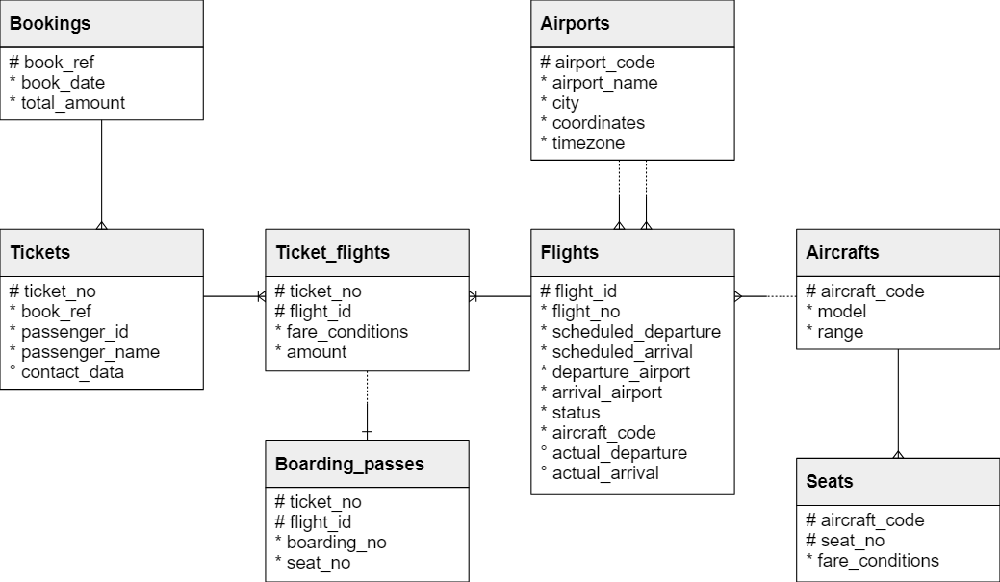

 # Описание структуры припарируемых таблиц
___

**Использовал для экспериментов demo-small-en с официального сайта postgresql**

https://postgrespro.com/docs/postgrespro/15/demodb-bookings-installation

**Структура**



___
- [x] Реализовать прямое соединение двух или более таблиц
___

**Выполнил INNER JOIN запрос**
```commandline
~$ sudo -u postgres psql -d demo -c "SELECT bookings.airports.airport_name, bookings.flights.* 
FROM bookings.flights 
JOIN bookings.airports on bookings.flights.arrival_airport = bookings.airports.airport_code limit 10;"
```


| airport_name                       | flight_id | flight_no | scheduled_departure    | scheduled_arrival      | departure_airport | arrival_airport | status    | aircraft_code | actual_departure | actual_arrival |
|------------------------------------|-----------|-----------|------------------------|------------------------|-------------------|-----------------|-----------|---------------|------------------|----------------|
| Bratsk Airport                     | 1185      | PG0134    | 2017-09-10 06:50:00+00 | 2017-09-10 11:55:00+00 | DME               | BTK             | Scheduled | 319           |                  |                |
| Khanty Mansiysk Airport            | 3979      | PG0052    | 2017-08-25 11:50:00+00 | 2017-08-25 14:35:00+00 | VKO               | HMA             | Scheduled | CR2           |                  |                |
| Sochi International Airport        | 4739      | PG0561    | 2017-09-05 09:30:00+00 | 2017-09-05 11:15:00+00 | VKO               | AER             | Scheduled | 763           |                  |                |
| Ufa International Airport          | 5502      | PG0529    | 2017-09-12 06:50:00+00 | 2017-09-12 08:20:00+00 | SVO               | UFA             | Scheduled | 763           |                  |                |
| Ulyanovsk Baratayevka Airport      | 6938      | PG0461    | 2017-09-04 09:25:00+00 | 2017-09-04 10:20:00+00 | SVO               | ULV             | Scheduled | SU9           |                  |                |
| Kurgan Airport                     | 7784      | PG0667    | 2017-09-10 12:00:00+00 | 2017-09-10 14:30:00+00 | SVO               | KRO             | Scheduled | CR2           |                  |                |
| Orenburg Central Airport           | 9478      | PG0360    | 2017-08-28 06:00:00+00 | 2017-08-28 08:35:00+00 | LED               | REN             | Scheduled | CR2           |                  |                |
| Syktyvkar Airport                  | 11085     | PG0569    | 2017-08-24 12:05:00+00 | 2017-08-24 13:10:00+00 | SVX               | SCW             | Scheduled | 733           |                  |                |
| Irkutsk Airport                    | 11847     | PG0498    | 2017-09-12 07:15:00+00 | 2017-09-12 11:55:00+00 | KZN               | IKT             | Scheduled | 319           |                  |                |
| Magnitogorsk International Airport | 12012     | PG0621    | 2017-08-26 13:05:00+00 | 2017-08-26 14:00:00+00 | KZN               | MQF             | Scheduled | CR2           |                  |                |

**В запросе опущено ключевое слово `INNER` но именно этот тип соединения и указан**

___
- [ ] Реализовать левостороннее (или правостороннее)
___
**Преобразуем предыдущий запрос, так как нас интересует сопоставление всех данных из правой таблицы 
`bookings.flights` со справочником в левой таблице, таким образом мы сможем найти те ситуации для которых в справочнике 
аэропортов нет расшифровки кода аэропорта**

```commandline
~$ sudo -u postgres psql -d demo -c "SELECT bookings.airports.airport_name, bookings.flights.flight_no 
FROM bookings.flights 
LEFT JOIN bookings.airports on bookings.flights.arrival_airport = bookings.airports.airport_code 
WHERE bookings.airports.airport_name is Null;"
 airport_name | flight_no
--------------+-----------
(0 rows)
```
**Получаем, что таких ситуаций нет, если же мы из запроса уберем условие, то полуим картину как в первом пункте задания**

```commandline
~$ sudo -u postgres psql -d demo -c "SELECT bookings.airports.airport_name, bookings.flights.flight_no
> FROM bookings.flights
> LEFT JOIN bookings.airports on bookings.flights.arrival_airport = bookings.airports.airport_code limit 10;
> "
            airport_name            | flight_no
------------------------------------+-----------
 Bratsk Airport                     | PG0134
 Khanty Mansiysk Airport            | PG0052
 Sochi International Airport        | PG0561
 Ufa International Airport          | PG0529
 Ulyanovsk Baratayevka Airport      | PG0461
 Kurgan Airport                     | PG0667
 Orenburg Central Airport           | PG0360
 Syktyvkar Airport                  | PG0569
 Irkutsk Airport                    | PG0498
 Magnitogorsk International Airport | PG0621
(10 rows)
```
___

- [x] соединение двух или более таблиц
___

**Название аэропорта есть не только в месте отправления, но и в месте прибытия**
```commandline
~$ sudo -u postgres psql -d demo -c "SELECT bookings.airports.airport_name, bookings.flights.flight_no, airports2.airport_name 
> FROM bookings.flights
> LEFT JOIN bookings.airports on bookings.flights.arrival_airport = bookings.airports.airport_code 
> LEFT JOIN bookings.airports as airports2 on bookings.flights.departure_airport = airports2.airport_code 
> limit 10;"

            airport_name            | flight_no |            airport_name
------------------------------------+-----------+------------------------------------
 Bratsk Airport                     | PG0134    | Domodedovo International Airport
 Khanty Mansiysk Airport            | PG0052    | Vnukovo International Airport
 Sochi International Airport        | PG0561    | Vnukovo International Airport
 Ufa International Airport          | PG0529    | Sheremetyevo International Airport
 Ulyanovsk Baratayevka Airport      | PG0461    | Sheremetyevo International Airport
 Kurgan Airport                     | PG0667    | Sheremetyevo International Airport
 Orenburg Central Airport           | PG0360    | Pulkovo Airport
 Syktyvkar Airport                  | PG0569    | Koltsovo Airport
 Irkutsk Airport                    | PG0498    | Kazan International Airport
 Magnitogorsk International Airport | PG0621    | Kazan International Airport
(10 rows)
```

**Поскольку пришлось 2 раза присоединять одну и ту же таблицу  `bookings.airports` используем кострукцию переименования 
в данном запросе второй раз присоединенной таблицы `bookings.airports as airports2`**
___

- [x] Реализовать кросс соединение двух или более таблиц
___
**Не вполне понимаю практическое значение данного соединения `все-все`. Для его реализации сравним выполнение 2х запросов**
```commandline
~$ sudo -u postgres psql -d demo -c "SELECT count(*)
 FROM bookings.airports
 CROSS JOIN bookings.flights;"
  count
---------
 3444584
(1 row)
```

**И**

```commandline
~$ sudo -u postgres psql -d demo -c "SELECT count(*)
 FROM bookings.flights
 FULL JOIN bookings.airports on bookings.flights.arrival_airport = bookings.airports.airport_code;"
 count
-------
 33121
(1 row)
```
**В результате кросс соединения мы получили все возможные варианты связей таблиц, потому их колличество
и отличается в количество записей в справочнике аэропортов (в 104 раза)**
___
- [x] Реализовать полное соединение двух или более таблиц
___
**Для его реализации выполняю**
```commandline
~$ sudo -u postgres psql -d demo -c "SELECT bookings.airports.airport_name, bookings.flights.flight_no
> FROM bookings.flights
> FULL JOIN bookings.airports on bookings.flights.arrival_airport = bookings.airports.airport_code limit 10;"
            airport_name            | flight_no
------------------------------------+-----------
 Bratsk Airport                     | PG0134
 Khanty Mansiysk Airport            | PG0052
 Sochi International Airport        | PG0561
 Ufa International Airport          | PG0529
 Ulyanovsk Baratayevka Airport      | PG0461
 Kurgan Airport                     | PG0667
 Orenburg Central Airport           | PG0360
 Syktyvkar Airport                  | PG0569
 Irkutsk Airport                    | PG0498
 Magnitogorsk International Airport | PG0621
(10 rows)
```
**Какого-то профита в данном случае нам запрос не дает, так как в таблицах с данными не 
подразумевается каких-то вылетов, для которых не будет данных в справочнике**
___
- [x] Реализовать запрос, в котором будут использованы разные типы соединений
___
**Для реализации можем выполнить**
```commandline
~$ sudo -u postgres psql -d demo -c "SELECT bookings.airports.airport_name, bookings.flights.flight_no, airports2.airport_name 
> FROM bookings.flights
> LEFT JOIN bookings.airports on bookings.flights.arrival_airport = bookings.airports.airport_code 
> INNER JOIN bookings.airports as airports2 on bookings.flights.departure_airport = airports2.airport_code 
> limit 10;"

            airport_name            | flight_no |            airport_name
------------------------------------+-----------+------------------------------------
 Bratsk Airport                     | PG0134    | Domodedovo International Airport
 Khanty Mansiysk Airport            | PG0052    | Vnukovo International Airport
 Sochi International Airport        | PG0561    | Vnukovo International Airport
 Ufa International Airport          | PG0529    | Sheremetyevo International Airport
 Ulyanovsk Baratayevka Airport      | PG0461    | Sheremetyevo International Airport
 Kurgan Airport                     | PG0667    | Sheremetyevo International Airport
 Orenburg Central Airport           | PG0360    | Pulkovo Airport
 Syktyvkar Airport                  | PG0569    | Koltsovo Airport
 Irkutsk Airport                    | PG0498    | Kazan International Airport
 Magnitogorsk International Airport | PG0621    | Kazan International Airport
(10 rows)
```
**В практических целях редко используется только 1 тип соединений, 
если речь идет о запросе на более 10 таблиц для получения строгой выборки.**
___